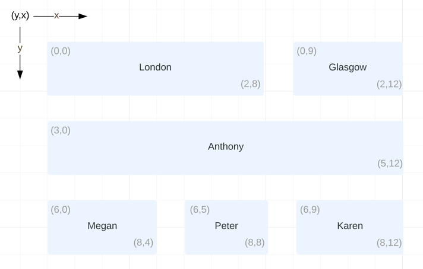

## The Offices

Below is a small section of an Obashi B&IT diagram taken from the ownership layer. 

The diagram snippet represents two offices within an organisation, London and Glasgow with a total of four employees. Anthony divides his 
time between both offices and manages Megan and Peter in the London office while managing Karen in the Glasgow office. 

*A typical segment from a B&IT diagram (co-ordinates not usually shown)* 

## Task 

Below are three scenarios involving the diagram above. For each list the **logical** steps involved in answering the question and how 
this could be done programmatically. The output should be in a file called `ANSWERS.md` and live in the same directory as this file. Any supporting resources 
should be placed into `resources` directory. 

1. The company owner wishes to know who works at the London office. From the diagram and the description above it is fairly 
clear however consider how you could work this out programmatically (the co-ordinates are there to assist).
   
2. To boost skills the company is looking to cross train people who are co-located. Peter is familiar with Sage - who could he train?

3. As part of a company wide initiative the owner would like to acquaint employees who work in physically different locations - if Karen 
starts a video call who else should be on it?

Are there any common patterns or reusable logic in your answers? 
